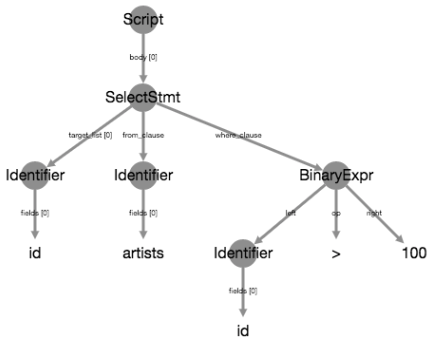

Tutorial
--------

sqlwhat uses the ``.`` to 'chain together' SCT functions. Every chain starts with the ``Ex()`` function call, which holds the exercise state.
This exercise state contains all the information that is required to check if an exercise is correct, which are:

+ the student submission and the solution as text, and their corresponding parse trees.
+ the result of running the solution query, as a dictionary of columns.
+ the result of running the student's query, as a dictionary of columns
+ the errors that running the student's query generated, if any.

As SCT functions are chained together with ``.``, the ``Ex()`` exercise state is copied and adapted into 'sub states' to zoom in on particular parts of the state.
Before this theory blows your brains out, let's have a look at some basic examples.

Example 1: query result
=======================

Assume we want to robustly check whether a student correctly selected the columns ``title`` from the table ``films``:

.. code-block:: sql

    SELECT title FROM films

The following SCT would verify this:

.. code-block:: python

    Ex().check_column('title').has_equal_value()

Let's see what happens when the SCT runs:

- ``Ex()`` returns the 'root state', which contains a reference to the student query, the solution query,
  the result of running the student's query, and the result of running the solution query.
- ``check_column('title')`` looks at the result of running the student's query and the solution query, and verifies that they are there.

  + If the student had submitted ``SELECT title, year FROM films``,
    the query result will contain the column ``title``, and the function will not fail.
  + If the student had submitted ``SELECT year FROM films``,
    the query result will not contain the column ``title``,
    the function will fail, and sqlwhat will automatically generate a meaningful feedback message.

  If ``check_column('title')`` runs without errors, it will return a sub-state of the root-state returned by ``Ex()``,
  that zooms in solely on the ``title`` column of the query result.
  This means that ``Ex().check_column('title')`` will produce the same substate for the following student submissions:

  .. code-block:: sql

        SELECT title FROM films
        SELECT title, year FROM films
        SELECT * FROM films

- ``has_equal_value()`` will consider the state produced by ``check_column('title')`` and verify whether
  the contents of the columns match between student and solution query result.

  + If the student had submitted ``SELECT title FROM films``,
    the query result of the student submission an the solution will exactly match, and the function will pass.
  + If the student had submitted ``SELECT title, year FROM films``,
    the ``title`` column of the student's query result and the solution query result will still exactly match, and the function will pass.
    Note: there are ways to be more restrictive about this, and making sure that the SCT fails if additonal columns were returned.
  + If the student had submitted ``SELECT title FROM films LIMIT 5``,
    the query result of the student and solution submission will not match the ``title`` column in the student query result.
    The function will fail, and slqhwat will automatically genearte a meaningful feedback message.

Example 2: AST-based checks
===========================

As another example, suppose we want to robustly check whether a student correctly selected the
``id`` column from an ``artists`` table with a certain condition:

.. code-block:: sql

    SELECT id FROM artists WHERE id > 100

In line with Example 1, the following SCT would robustly verify the result of the query:

.. code-block:: python

    Ex().check_column('id').has_equal_value()

If the student makes a mistake, this SCT will produce a feedback message in the direction of:
"Check the result of your query. Column ``id`` seems to be incorrect.". Although this is valid feedback,
you'll typically want to be more targeted about the actual mistake in the code of the student.
This is where the AST-based checks come in.

Where functions such as ``check_column()`` and ``has_equal_value()`` look at the `result` of your query,
AST-based checks will look at the query `itself`.
More specifically, they will look at the Abstract Syntax Tree representation of the query,
which enables us to robustly look and check for certain patterns and constructs.

To explore the AST representation of a SQL query, visit the `AST viewer <https://ast-viewer.datacamp.com>`_.
The AST for the ``SELECT`` statement above is:

Notice how the statement is neatly chopped up into its consituents: the ``SELECT`` statement is chopped up into three parts:
the ``target_list`` (which columns to select), the ``from_clause`` (from which table to select) and the ``where_clause`` (the condition that has to be satisfied).
Next, the ``where_caluse`` is a ``BinaryExpr`` that is further chopped up.

Similar to how ``check_column('title')`` zoomed in on only the ``title`` column of the student's and solution query result, you can use the ``.`` operator
to chain together AST-verifying SCT functions that each zoom in on particular parts of the student's submission and the solution.

Suppose you want to check whether students have correctly specified the table from which to select columns (the ``FROM artists`` part). This SCT script does that:

.. code-block:: python

    Ex().check_node("SelectStmt").check_edge("from_clause").has_equal_ast()

We'll now explain step by step what happens when a student submits the following (incorrect) code:

.. code-block:: sql

    SELECT id FROM producers WHERE id > 100

When the SCT executes:

- ``Ex()`` runs first, and fetches the root state that considers the entire student submission and solution:

    .. code-block:: sql

        -- solution
        SELECT id FROM artists WHERE id > 100

        -- student
        SELECT id FROM producers WHERE id > 100

  This is the corresponding AST of the solution.
  This is the same tree as included earlier in this article.
  The AST for the student submission will look very similar.

  .. image:: ast_example.png
     :align: center
     :scale: 80%

- Next, ``check_node()`` chains off of the state produced by ``Ex()`` and
  produces a child state that focuses on the ``SelectStmt`` portion of the submission and solution:

    .. code-block:: sql

        -- solution
        SELECT id FROM artists WHERE id > 100

        -- student
        SELECT id FROM producers WHERE id > 100

  The corresponding AST of the solution is the following. Notice that although the textual representation is the same as ``Ex()``,
  the AST representation no longer includes the ``Script`` node. The AST for the student submission will look very similar.

  .. image:: ast_example2.png
     :align: center
     :scale: 80%

- Next, ``check_edge()`` chains off of the state produced by ``check_node()`` and zooms in on the ``from_clause`` branch of the AST:

    .. code-block:: sql

        -- solution
        artists

        -- student
        producers

  The corresponding ASTs for solution and student are as follows:

  .. image:: ast_example3_combi.png
     :align: center
     :width: 300px

- Finally, ``has_equal_ast()`` chains off of the state produced by ``check_edge()`` and
  checks whether the student submission and solution sub-ASTs correspond.
  As the solution expects ``artists`` while the student specified ``producers`` the SCT fails
  and sqlwhat will generate a meaningful feedback message.

.. note::

    - ``check_node()`` is used to select a `node` of the AST tree (a circle in the image).
    - ``check_edge()`` is used to walk down a `branch` of the AST tree (a line in the image).

Example 3: Combining result checks and AST checks
=================================================

In general, you want to write flexible SCTs: if students get the end result right, you don’t want to be picky about how they got there.
However, when they do make a mistake, you want to be specific about the mistake they are making.
In other words, a good SCT is robust against different ways of solving a problem, but specific when something’s wrong.

Example 1 looked at the result of a query, which are perfect to match the flexibility requirement.
Example 2 looks at the AST representation of the code, which is good to dig deeper into the code a student submitted to see what's going on.

With ``check_correct()``, you can effectively combine these two seemingly conflicting approaches. Reiterating over the query of Example 2:

.. code-block:: sql

    SELECT id FROM artists WHERE id > 100

we can write the following SCT, that is both flexible:

.. code-block:: python

    Ex().check_correct(
        check_column('id').has_equal_value(),
        check_node('SelectStmt').multi(
            check_edge('from_clause').has_equal_ast(),
            check_edge('where_clause').has_equal_ast()
        )
    )

Notice how ``check_correct()`` starts from ``Ex()`` and is passed two arguments.

The first argument is an SCT chain of result-based checks that starts from the state passed to ``check_correct()`` (``Ex()`` in this case).
If this SCT chain passes when executed, the second argument of ``check_correct()`` is no longer executed.
If this SCT chain fails, the SCT does not fail and throw a feedback message. Instead, the second argument, an SCT of AST-based checks
is executed that also starts from the state passed to ``check_correct()``. This chain will generate more detaild feedback.

.. note::

    - ``check_correct()`` passes the state it chains off of to its arguments, the subchains.
    - ``multi()`` is used to 'split SCT chains' from the state it chains off of, and passes this state to its arguments.

This SCT:

- is flexible if the student got the right end result.
  For all of the following queries, the `check_column('id').has_equal_value()` chain passes, so the `check_node()` chain does not run:

  .. code-block:: sql

        SELECT id FROM artists WHERE id > 100
        SELECT id, name FROM artists WHERE id > 100 AND id < 0
        SELECT id FROM artists WHERE id > 100 ORDER BY id DESC

- generates specific feedback if the student made a mistake:
  Instead of the generic "Column ``id`` seems to be incorrect" message, there are more targeted messages:

  .. code-block:: sql

        SELECT id FROM labels WHERE id > 100            -- "Check the FROM clause."
        SELECT id FROM artists WHERE id > 50            -- "Check the WHERE clause."
        SELECT id FROM artists WHERE id > 100 LIMIT 5   -- "The column id seems to be incorrect."

  Notice how for the last example here, all functions in the AST-based SCT chain passed.
  In this case, the more generic message is still thrown in the end.

Have a look at the glossary for more examples of SCTs that nicely combine these two families of SCT functions.

For other guidelines on writing good SCTs, check out the 'How to write good SCTs' section on DataCamp's
`general SCT documentation page <https://authoring.datacamp.com/courses/exercises/technical-details/sct.html>`_.
